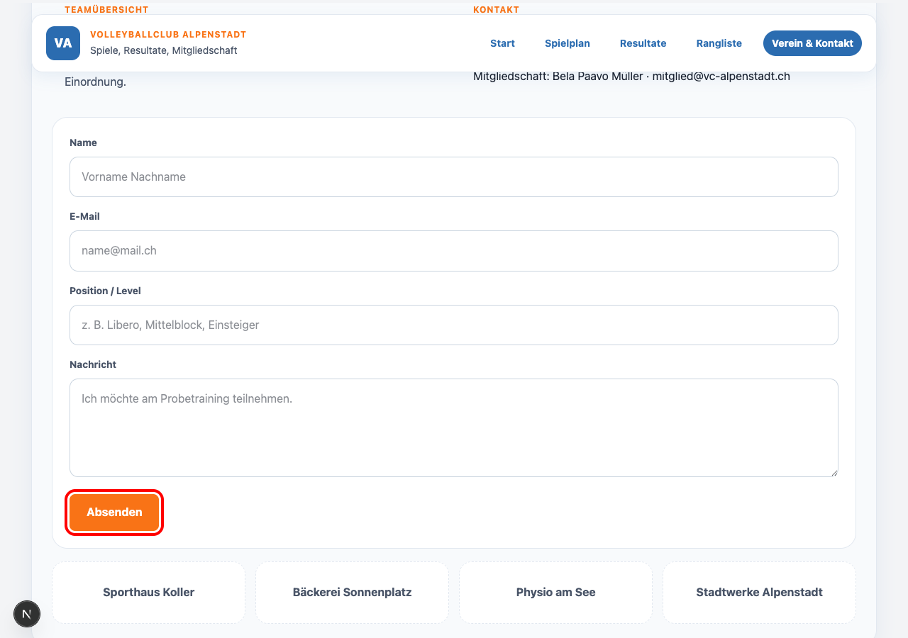
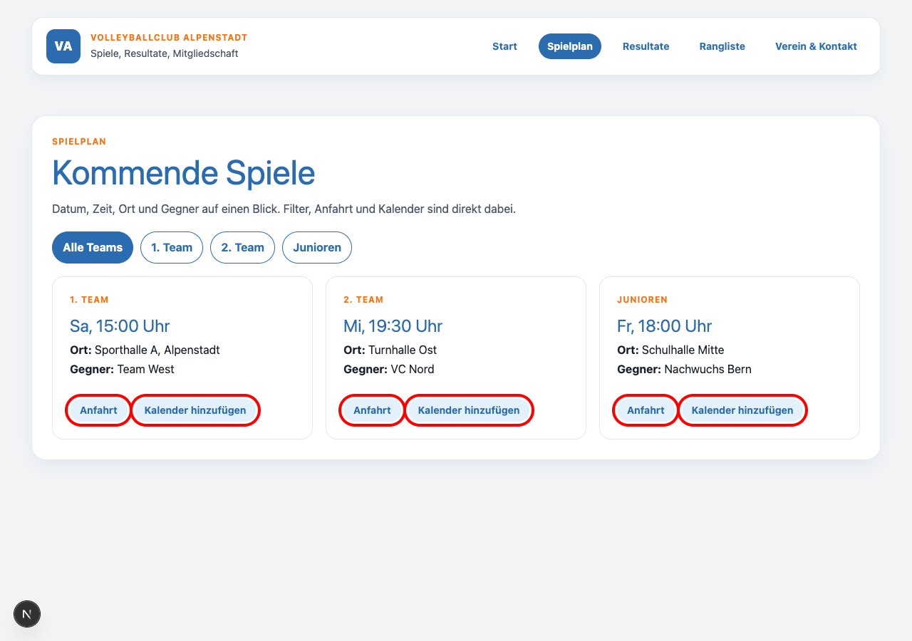

# M322 – Usability-Bewertungsbericht

**Produkt:** Volleyballclub Alpenstadt (Next.js-Website) · **Datum:** 22.05.2026 · **Klasse:** S-INA24dl · **Name(n):** Alina, Bela, Leon

---

## Einleitung

Bewertet wird die Website des Volleyballclub Alpenstadt mit den Bereichen Startseite, Spielplan, Resultate, Rangliste und Kontakt. Zielgruppe ist Andrin Wirz (ca. 20 Jahre, technikaffiner Volleyballer, Rot-Grün-Schwäche), der Spielinfos abrufen und dem Club beitreten möchte. Ziel der Website ist es, Spielplan, Resultate und Mitgliedschaft mobil zugänglich bereitzustellen.

## Methode

Heuristische Evaluation nach **Nielsen/Molich (10 Heuristiken)**. Drei Tasks aus Andrin's Sicht:
1. *„Du willst dem Club beitreten – sende eine Probetraining-Anfrage."*
2. *„Wann und wo spielt das 1. Team als nächstes?"*
3. *„Du hast das letzte Spiel verpasst – finde das Resultat und teile es."*

## Stärken

| # | Was funktioniert gut | Heuristik |
|---|---|---|
| 1 | Aktive Navigation mit visuell hervorgehobenem Link – Andrin weiss jederzeit, wo er sich befindet | H4 – Konsistenz & Standards |
| 2 | Spielplan-Teamfilter reagiert sofort ohne Seitenreload | H1 – Systemstatus sichtbar |

## Probleme & Verbesserungen (Top-5)

| # | Problem | Heuristik | Auswirkung | Verbesserung |
|---|---|---|---|---|
| 1 | Kontaktformular: Senden-Button ist `type="button"` – kein Submit, keine Rückmeldung *(Screenshot A)* | H1 – Systemstatus | Andrin weiss nicht, ob seine Anfrage ankam | `type="submit"` + Erfolgsmeldung „Anfrage gesendet – wir melden uns innert 48h" |
| 2 | Spielplan: „Anfahrt" und „Kalender hinzufügen" sind `` – nicht klickbar *(Screenshot B)* | H4 – Konsistenz | Klick bleibt ohne Reaktion, Andrin findet die Halle nicht | Ersetzen durch `<a href="maps.google.com/...">` bzw. `.ics`-Download-Link |
| 3 | Kontaktseite: Karte ist ein grauer Platzhalter mit Text „Anfahrt" | H6 – Wiedererkennen | Andrin muss Adresse selbst in Maps eintippen | Link zu Google Maps mit vorausgefüllter Adresse |
| 4 | Footer fehlt auf 4 von 5 Seiten (Spielplan, Resultate, Rangliste, Kontakt) | H4 – Konsistenz | Kein konsistentes Seitenende, fehlende Kontaktinfos | `<SiteFooter />` global in `layout.tsx` einbinden |
| 5 | Resultate: Sieg/Niederlage nur durch Farbpunkt signalisiert – kein Icon, kein ARIA-Label | H4 – Konsistenz; Accessibility | Für Andrin (Rot-Grün-Schwäche) schwer unterscheidbar | Farbpunkt durch Icon (✓/✗) ersetzen, ARIA-Label ergänzen |

## Beleg

**Screenshot A – Kontaktformular, Senden-Button ohne Feedback**
Der „Absenden"-Button ist als `type="button"` implementiert – ein Klick löst keinen Submit aus und zeigt keine Rückmeldung.

**Screenshot B – Spielplan, nicht-klickbare Badges**
„Anfahrt" und „Kalender hinzufügen" sehen aus wie Links, sind aber ``-Elemente ohne Klick-Handler.

## Fazit

Das grösste Problem ist das nicht-funktionale Kontaktformular: Andrin kann seine Mitgliedschaftsanfrage nicht abschicken und erhält kein Feedback – Task 1 scheitert vollständig. Der schnellste Fix ist `type="submit"` mit einer Bestätigungsmeldung. Die Website ist sprachlich klar und visuell konsistent, benötigt aber gezielte Korrekturen bei interaktiven Elementen und der seitenweiten Konsistenz.
